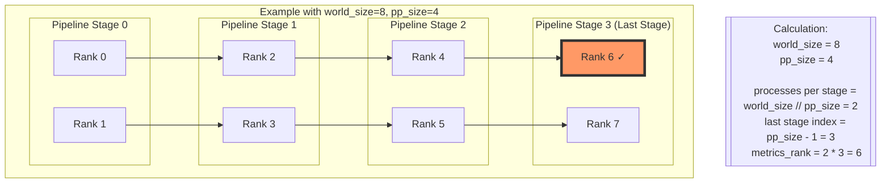

# Some misc notes

Default logging with TB is not great so I opened a PR with W&B https://github.com/pytorch/torchtitan/pull/699 which I've been using for all my experiments

Considering I basically always need to run with at least GPUs I might need to kick my colleagues so running alias `alias whoisongpu="nvidia-smi | grep 'python' | awk '{print \$5}' | xargs ps -o pid,lstart,cmd"` to help me out


There doesn't seem to be an easy way of running on less than the full machine worth of gpus

The entry point for the whole thing seems to be `train.py`


## float8

float8 support is fairly simple
1. Check if sm > 8.9 and if torchao is installed
2. if any of the inputs or weights or grad have delayed scaling then do that
3. float8 conversion is in place mutation
4. dynamic quantization is done using simple ops that work over dtensors like max, amax, to conversions


<details>
<summary> Mermaid diagram of how things work </summary>
graph TB
    %% Overview
    %% This diagram illustrates the initialization and execution flow of
    %% Tensor Parallel (TP) and FSDP2 in a neural network layer.
    %% The process involves two main phases: initialization and forward/backward pass.

    subgraph Initialization ["Initialization Phase"]
        %% Begin with standard PyTorch linear layer
        A[nn.Linear<br/>weight=torch.Tensor] -->|convert_to_float8_training| B[Float8Linear<br/>weight=WeightWithDynamicFloat8CastTensor]

        %% Apply tensor parallelism to shard across devices
        B -->|parallelize_module<br/>shards rowwise/colwise| C["Float8Linear<br/>weight=DTensor<br/>(mesh=[0,1], names='tp')<br/>placements=Shard(dim=0)"]

        %% Apply FSDP2 for data parallel training
        C -->|fully_shard<br/>shards rowwise dim=0| D["Float8Linear<br/>weight=DTensor<br/>(mesh=[[0,1],[2,3]], names=['dp','tp'])<br/>placements=[Shard(0),Shard(0)]"]
    end

    subgraph Forward/Backward ["Forward/Backward Phase"]
        %% FSDP unsharding operation
        D -->|FSDP unshards within dp mesh| E["Float8Linear<br/>weight=DTensor<br/>(mesh=[0,1], names='tp')<br/>placements=Shard(dim=0)"]

        %% Final tensor parallel computation
        E -->|torch.mm<br/>input, weight| F[TP Compute]
    end

    %% Styling definitions
    classDef default fill:#f9f9f9,stroke:#333,stroke-width:2px;
    classDef phase fill:#e1f3f8,stroke:#0077b6,stroke-width:2px;
    class Initialization,Forward/Backward phase;

    %% Documentation notes as Mermaid comments
    %% Device Mesh:
    %% - Initial: Single device
    %% - After TP: [0,1] (1D mesh for tensor parallel)
    %% - After FSDP: [[0,1],[2,3]] (2D mesh for data parallel + tensor parallel)
    %%
    %% Sharding:
    %% - TP shards: Along dimension 0 (rowwise/colwise)
    %% - FSDP shards: Along dimension 0 (rowwise)
    %%
    %% Key Operations:
    %% - convert_to_float8_training: Converts weights to Float8 format
    %% - parallelize_module: Applies tensor parallel sharding
    %% - fully_shard: Applies FSDP2 sharding
    %% - unshard: Reconstructs full tensors within dp mesh
    %% - torch.mm: Matrix multiplication in TP compute
</details>


## Checkpointing

checkpoint.py

There's 3 kinds of checkpoints: disabled, async and asyn with pinned memory. Presumably we don't want to lock the job while we're saving over n machines.

At every iteration sync global_avg_losses and global_max_losses

Specficially need to implement

`from torch.distributed.checkpoint.stateful import Stateful`

The stateful inteface which needs two functions implemented state_dict() and load_state_dict which map to save and load in the context of regular non DCP torch.save

Checkpointing becomes significantly more complicated with pipeline parallelism, I've heard karpathy say no codebase survives TP and this is maybe what he means

When a checkpoint gets triggered it awaits to see when resource constraints arent as sever to complete the save


## Pipeline

pipeline_llama.py

pipeline_llama involves 2 steps
1. A split which gives us stages and a model list
2. a schedule

What these are is not super clear from this file

## Parallelize

parallilize_llama.py

applies TP, AC, torch.compile and data parllalism. Also assumes model is on meta device otherwise it might OOM


There's a file called parallel_dims with a

class ParallelDims which describes: data paralllsim, cp, tp, pp, world size and enable loss parallel


Important identity = dp_replicate * dp_shard * cp * tp * pp = world_size


Interesting they call dp_sharp instead of model parallel? But something to double check and look into


## Model.py

The model does not have any parallel specific things


## Train.py entrypoint

1. This code implements a distributed training system for large language models. It starts by setting up the training environment, including logging, random seed settings, and distributed training configuration across multiple GPUs. The system supports various forms of parallelism like data parallel, tensor parallel, and pipeline parallel training to handle large models efficiently.
2. The training process begins by initializing the tokenizer and data loader to handle the input text data. It then builds the language model based on a specified configuration, with support for different model architectures. The code includes special handling for float8 precision training to improve efficiency.
3. For optimization, the system sets up optimizers and learning rate schedulers. It implements a checkpointing system that can save and load model states, allowing training to be resumed from previous checkpoints.
4. The main training loop processes batches of data iteratively. In each step, it feeds input data through the model, calculates the loss using cross entropy, performs backward propagation to compute gradients, and updates the model parameters. For pipeline parallel training, the data is processed in chunks across different GPU stages.
5. Throughout training, the code monitors and logs various metrics including loss values, training speed (tokens per second), model FLOPs utilization, memory usage, and timing information. These metrics are logged at regular intervals and can be visualized using TensorBoard.
6. The system includes several optimization features like gradient clipping, garbage collection control, and memory monitoring. It also supports advanced features like CPU offloading for handling larger models and profiling capabilities for performance analysis.
7. When training completes or reaches a specified number of steps, it saves the final checkpoint and cleans up the distributed process group. The code is designed to be robust, with error handling and timeout settings to manage distributed training coordination.


Set parallel_dims

Used to build a mesh (TODO: what's a mesh exactly)


## pp

* Pipeline Bubbles: waiting for data. These bubbles are unavoidable overhead in pipeline parallelism.
* State Management: Each GPU needs to track multiple batches in different stages, making it hard to keep track of what's where.
* Bidirectional Flow: Unlike simpler parallelism strategies, data needs to flow both forward and backward through the pipeline simultaneously.
* Memory Challenge: You need to carefully manage when to store and free activations for the backward pass.
* Error Propagation: An error in any GPU can corrupt the entire pipeline, making debugging very difficult.


## My questions
* num_ooms is counted: does this mean


## Why does PP complicate a codebase

```
(marksaroufim) ➜  torchtitan git:(msaroufim/wandb) ✗ rg "if parallel_dims.pp_enabled:" .
./train.py
81:    if parallel_dims.pp_enabled:
154:    if parallel_dims.pp_enabled:
288:            if parallel_dims.pp_enabled:

./torchtitan/metrics.py
169:    if parallel_dims.pp_enabled:
```


Get the first rank of the last pipeline stage
```python
def _get_metrics_rank(parallel_dims: ParallelDims) -> int:
    """
    Returns global rank 0 in non-pipeline-parallel configs, and returns the global
    rank of the 0th rank in the last pipeline stage when pipeline parallelism is enabled.
    """
    if parallel_dims.pp_enabled:
        world_size = parallel_dims.world_size
        pp_size = parallel_dims.pp
        metrics_log_rank = (world_size // pp_size) * (pp_size - 1)
    else:
        metrics_log_rank = 0

    return metrics_log_rank

```





The other differences in train.py
1. mesh logic is different for pp
2.


It applies a pipeline parallel schedule using model-specific functions
The model is split into different parts/stages for pipeline parallelism
Each model part is then processed separately with:

SPMD (Single Program Multiple Data) parallelization techniques
Memory optimization (moving to empty device initially)
Weight initialization
Setting to training mode


Loss calculation is different

```python
            if parallel_dims.pp_enabled:
                # Pipeline Parallel forward / backward inside step() call
                is_last_stage = pp_mesh.get_local_rank() == pp_mesh.size() - 1

                with train_context(optional_context_parallel_ctx):
                    if pp_mesh.get_local_rank() == 0:
                        pp_schedule.step(input_ids)
                    elif is_last_stage:
                        losses = []
                        pp_schedule.step(target=labels, losses=losses)
                    else:
                        pp_schedule.step()

                # accumulate losses across pipeline microbatches
                loss = (
                    torch.mean(torch.stack(losses))
                    if is_last_stage
                    else torch.Tensor([-1.0])
                )
            else:
                # Non-PP forward / backward
                with train_context(optional_context_parallel_ctx):
                    pred = model(input_ids)
                    loss = loss_fn(pred, labels)
                    # pred.shape=(bs, seq_len, vocab_size)
                    # need to free to before bwd to avoid peaking memory
                    del pred
                    loss.backward()

```


Gradient clipping also different


```python

# clip gradients
clip_grad_norm_(
    [p for m in model_parts for p in m.parameters()],
    job_config.training.max_norm,
    foreach=True,
    pp_mesh=pp_mesh if parallel_dims.pp_enabled else None,
)

```

## Main components of train.py

1. Init device Mesh -> mesh is a cpu tensor. Device mesh is an n-d dimensional array which describes how work is mapped. Same mesh needs to be an all devices, it's SPMD same pytorch program needs to run everywhere
2.


## questions
1. what's the seed checkpoint stuff
2. worth splitting pp from the codebase
3. why train context: seems like it enables loss paralllism, compiled autograd and context parallelism
4. what's the point of compiled autograd here `torch._dynamo.utils.counters["compiled_autograd"]["compiles"] += 1` - has a weird way of being enabled
5. peak flops in utils.py is enterprise gpu specific
6. optimizer justt uses linear schedules and adam
7. DPaware data loader warppr around steful dataloader to ensure state is stored only once per DP rank. Mostly just targeting c4 dataset right now, so can do streaming dataset. streaming is a hf config
8. Memory tracker checked into core, needs a tabulate dependency, a torch dispatch mode
9. Norms are what you'd expect, only exception is a fused rms norm implemented in triton, easy to integrate triton, but potentially could write this using torch.compile but con is you need compile times
10. I dont understand whaht seed checkpoint is, how does it fit on a single device
11. Tokenizer doesn't have anything that's distributed specific, dataset does a bit just to ensure stateful data loading w/ reproducible training
12. How is the manual schedule splitting done exactly, not sure i really follow
13. why is flattening the mesh important
14. Prepare some picture for reduce scatter
15. ptd has a checkpoint_wrapper and SAC is generally an important topic it feels like here
16. reshard after forward detail not super clear
17. applying fsdp2 seems to be mostly about claling the fully_shard function
18. Otherwise apply_ddp also exists but unclear if that's still recommended?

```
"<|begin_of_text|>",
"<|end_of_text|>",
"<|reserved_special_token_0|>",
"<|reserved_special_token_1|>",
"<|reserved_special_token_2|>",
"<|reserved_special_token_3|>",
"<|start_header_id|>",
"<|end_header_id|>",
"<|reserved_special_token_4|>",
"<|eot_id|>",  # end of turn
```


## Parallelism folder

parallelim_dims, parallize_llama, pipeline_llama, pipeline_utils and utils

utils.py just some convenicence to deal with nightly versions of pytorch

Exposes a few public functions

```python
"models_parallelize_fns",
"models_pipelining_fns",
"ParallelDims",
```

pipeline_llama
1. Manual split a mesh, dimensions to get stages and models
2. Given stages buid a pp schedule
3. moanual split

parallel_dims
a single dataclass representing all the ways of parallelizing stuff

```
rg "cp" -g "*.py" .
```

Something like context parallism is just a different mesh, so a lot of magic is happening behind dtensor stuff

`from torch.distributed.tensor.experimental import context_parallel`


DOn't recompute things that are slow to compute like matmuls or sdpa

Have a good


```

# for selective op activation checkpointing
_save_list = {
    torch.ops.aten.mm.default,
    torch.ops.aten._scaled_dot_product_efficient_attention.default,
    torch.ops.aten._scaled_dot_product_flash_attention.default,
    torch.ops._c10d_functional.reduce_scatter_tensor.default,
}
```
